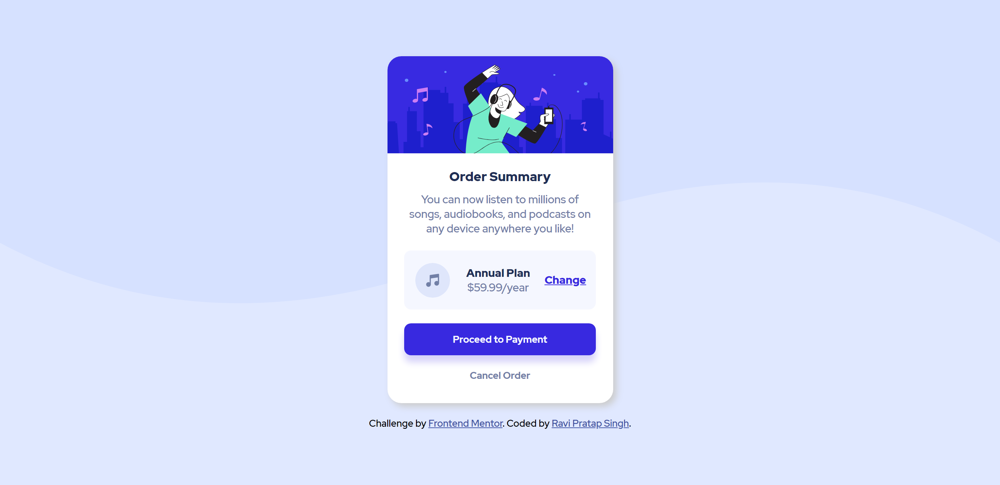

# Frontend Mentor - Order summary card solution

This is a solution to the [Order summary card challenge on Frontend Mentor](https://www.frontendmentor.io/challenges/order-summary-component-QlPmajDUj). Frontend Mentor challenges help you improve your coding skills by building realistic projects.

## Table of contents

- [Overview](#overview)
  - [The challenge](#the-challenge)
  - [Screenshot](#screenshot)
  - [Links](#links)
- [My process](#my-process)
  - [Built with](#built-with)
  - [What I learned](#what-i-learned)
  - [Continued development](#continued-development)
 
- [Author](#author)
- [Acknowledgments](#acknowledgments)

**Note: Delete this note and update the table of contents based on what sections you keep.**

## Overview

### The challenge

Users should be able to:

- See hover states for interactive elements

### Screenshot

### Links

- Solution URL: [https://github.com/cyberspatial/Order-summary-card/]
- Live Site URL: [https://cyberspatial.github.io/Order-summary-card/]

## My process
 - Writing the html code.
 - Adding styles to it.
 - Developing mobile-view first.
 - Adding media queries for the Desktop view. 

### Built with

- Semantic HTML5 markup
- CSS custom properties
- Flexbox
- Mobile-first workflow

### What I learned

Applying the HTML and CSS practically.
Using the flexbox.

### Continued development

- CSS grid
- React Js

## Author

- Frontend Mentor - [@cyberspatial](https://www.frontendmentor.io/profile/cyberspatial)
- Linkedin - [@RaviPratapSingh](https://www.linkedin.com/in/ravi-pratap-singh-62a367216/)

## Acknowledgments

Frontend Mentor for providing the images of designs.
